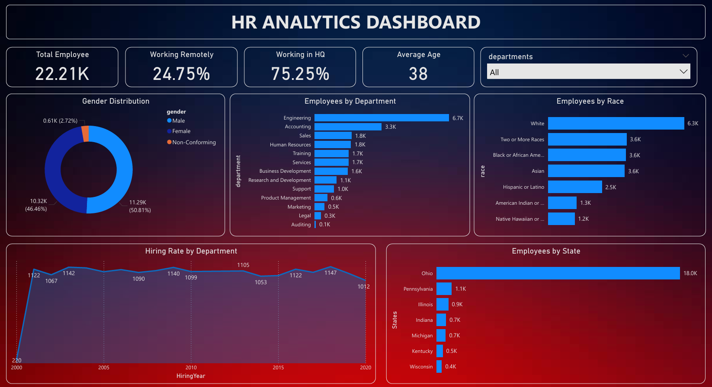

# HR Analytics Dashboard 📊

This project is an **HR Analytics Dashboard** built in **Power BI** to analyze workforce data and provide insights into employee demographics, diversity, department distribution, hiring trends, and more.

---

## 🚀 Project Overview
The dashboard was created using a dataset of **22,214 employees** with attributes such as age, gender, race, department, hire/term dates, and location.  
The goal of this project is to help organizations make **data-driven HR decisions** related to workforce planning, diversity, and retention.

---

## 📌 Project Objectives
- Track workforce demographics and diversity metrics.
- Monitor remote vs HQ workforce distribution.
- Analyze hiring trends across years.
- Understand workforce by department, race, state, and gender.
- Provide actionable insights to improve workforce planning.

---

## 🗂 Dataset Information
- **Records**: 22,214 employees  
- **Columns**: 13 features including age, race, gender, department, hire date, location, and employment status.  

---

## 📌 Key Features (implemented)
- KPI Cards: Total employees, Remote vs HQ %, Average Age  
- Visualizations: Hiring Rate (line), Gender Distribution (donut), Employees by Department/Race/State (bars)  
- Interactive filters (department, time) to explore data

---

## 📷 Dashboard Preview

---

## 🚀 Key Insights
- Workforce is almost evenly distributed: **50.8% Male, 46.5% Female**.  
- Around **25% of employees work remotely**, while **75% work in HQ**.  
- The **Engineering department** has the highest workforce (~6.7K employees).  
- **White, Asian, and Black employees** have similar representation (~3.6K each).  
- Hiring peaked around **early 2000s and 2010s** with 1,100+ hires per year.  
- **Ohio state** has the largest workforce (~18K employees).  

---

## ✅ Business Value
This HR analytics dashboard helps:  
- **HR teams** identify diversity gaps and workforce imbalances.  
- **Management** optimize workforce planning by department & location.  
- **Executives** make informed decisions on remote vs HQ workforce strategies.  

---

## 👨‍💻 Author
**Rohit Wagh**  
- 📧 Email: [rohitwagh6264@gmail.com](mailto:rohitwagh6264@gmail.com)
 

